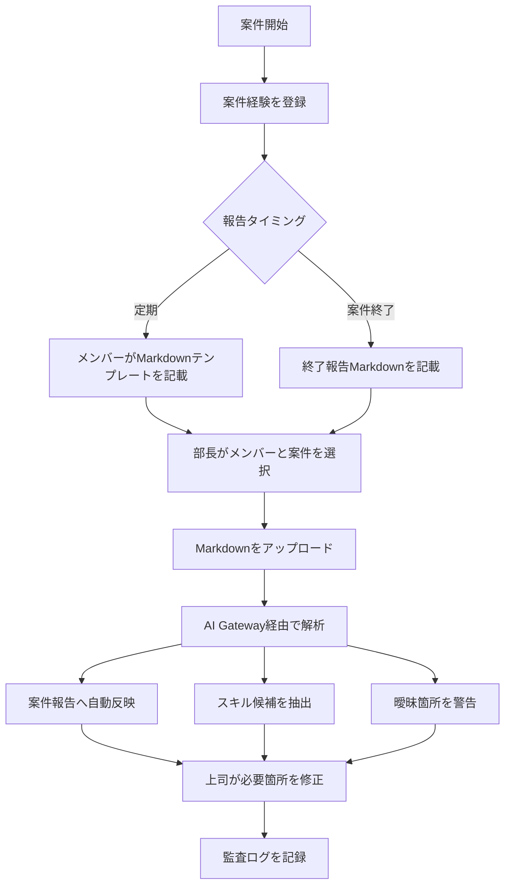
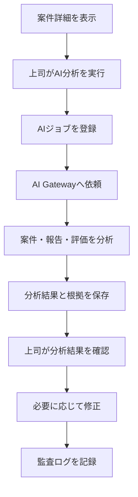
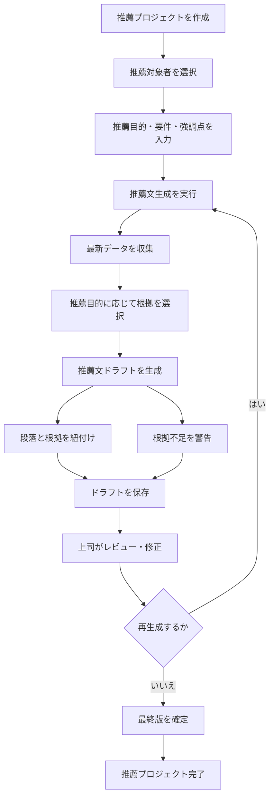
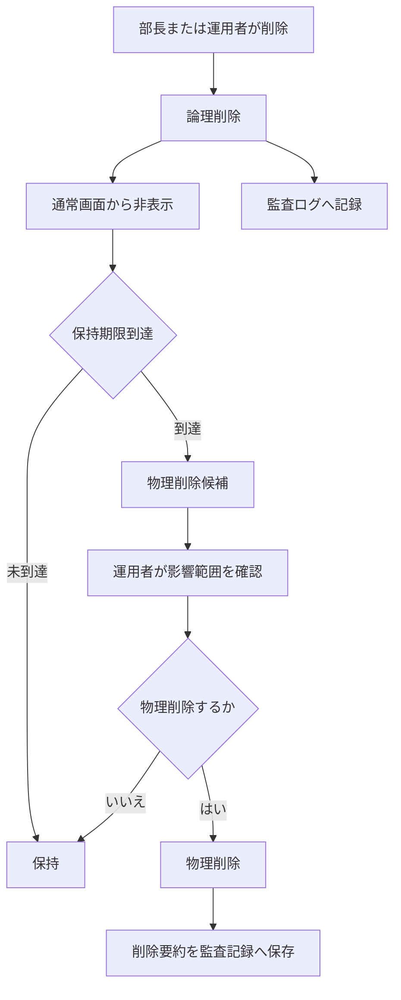

# 業務フロー

## 1. 案件情報蓄積フロー

```mermaid
flowchart TD
    A[案件開始] --> B[案件経験を登録]
    B --> C{報告タイミング}
    C -->|定期| D[メンバーがMarkdownテンプレートを記載]
    C -->|案件終了| E[終了報告Markdownを記載]
    D --> F[部長がメンバーと案件を選択]
    E --> F
    F --> G[Markdownをアップロード]
    G --> H[AI Gateway経由で解析]
    H --> I[案件報告へ自動反映]
    H --> J[スキル候補を抽出]
    H --> K[曖昧箇所を警告]
    I --> L[上司が必要箇所を修正]
    J --> L
    K --> L
    L --> M[監査ログを記録]
```

## 2. 任意の案件分析フロー

```mermaid
flowchart TD
    A[案件詳細を表示] --> B[上司がAI分析を実行]
    B --> C[AIジョブを登録]
    C --> D[AI Gatewayへ依頼]
    D --> E[案件・報告・評価を分析]
    E --> F[分析結果と根拠を保存]
    F --> G[上司が分析結果を確認]
    G --> H[必要に応じて修正]
    H --> I[監査ログを記録]
```

## 3. 推薦業務フロー

```mermaid
flowchart TD
    A[推薦プロジェクトを作成] --> B[推薦対象者を選択]
    B --> C[推薦目的・要件・強調点を入力]
    C --> D[推薦文生成を実行]
    D --> E[最新データを収集]
    E --> F[推薦目的に応じて根拠を選択]
    F --> G[推薦文ドラフトを生成]
    G --> H[段落と根拠を紐付け]
    G --> I[根拠不足を警告]
    H --> J[ドラフトを保存]
    I --> J
    J --> K[上司がレビュー・修正]
    K --> L{再生成するか}
    L -->|はい| D
    L -->|いいえ| M[最終版を確定]
    M --> N[推薦プロジェクト完了]
```

## 4. データ削除フロー

```mermaid
flowchart TD
    A[部長または運用者が削除] --> B[論理削除]
    B --> C[通常画面から非表示]
    B --> D[監査ログへ記録]
    C --> E{保持期限到達}
    E -->|未到達| F[保持]
    E -->|到達| G[物理削除候補]
    G --> H[運用者が影響範囲を確認]
    H --> I{物理削除するか}
    I -->|いいえ| F
    I -->|はい| J[物理削除]
    J --> K[削除要約を監査記録へ保存]
```
