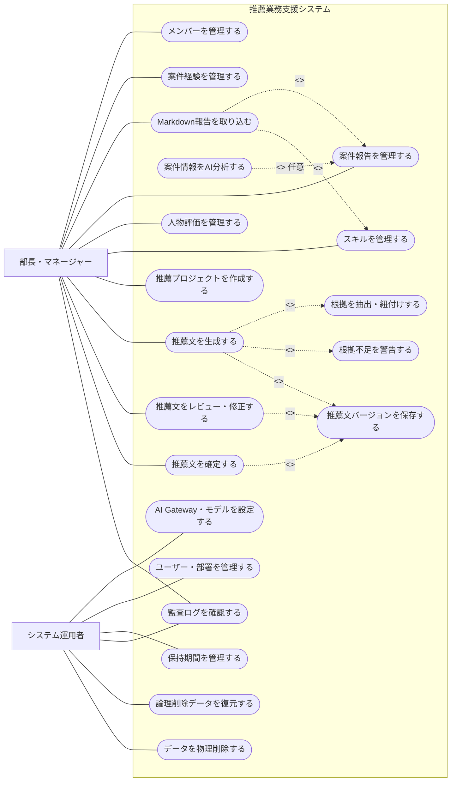

# UMLユースケース図

```mermaid
flowchart LR
    Manager[部長・マネージャー]
    Operator[システム運用者]

    subgraph System[推薦業務支援システム]
        Member([メンバーを管理する])
        Project([案件経験を管理する])
        Import([Markdown報告を取り込む])
        Report([案件報告を管理する])
        Analyze([案件情報をAI分析する])
        Evaluate([人物評価を管理する])
        Skills([スキルを管理する])

        RecProject([推薦プロジェクトを作成する])
        Generate([推薦文を生成する])
        Evidence([根拠を抽出・紐付けする])
        Warning([根拠不足を警告する])
        Review([推薦文をレビュー・修正する])
        Finalize([推薦文を確定する])
        Version([推薦文バージョンを保存する])

        AISettings([AI Gateway・モデルを設定する])
        Users([ユーザー・部署を管理する])
        Retention([保持期間を管理する])
        Audit([監査ログを確認する])
        Restore([論理削除データを復元する])
        Purge([データを物理削除する])
    end

    Manager --- Member
    Manager --- Project
    Manager --- Import
    Manager --- Report
    Manager --- Evaluate
    Manager --- Skills
    Manager --- RecProject
    Manager --- Generate
    Manager --- Review
    Manager --- Finalize
    Manager --- Audit

    Operator --- AISettings
    Operator --- Users
    Operator --- Retention
    Operator --- Audit
    Operator --- Restore
    Operator --- Purge

    Analyze -. "<<extend>> 任意" .-> Report
    Import -. "<<include>>" .-> Report
    Import -. "<<include>>" .-> Skills
    Generate -. "<<include>>" .-> Evidence
    Generate -. "<<include>>" .-> Warning
    Generate -. "<<include>>" .-> Version
    Review -. "<<include>>" .-> Version
    Finalize -. "<<include>>" .-> Version
```
