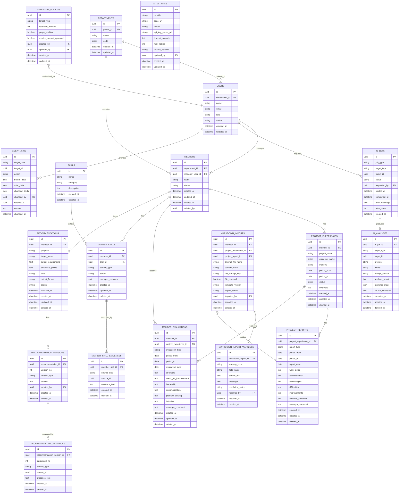

# ER図

```mermaid
erDiagram
    DEPARTMENTS ||--o{ USERS : belongs_to
    DEPARTMENTS ||--o{ MEMBERS : contains
    USERS ||--o{ MEMBERS : manages

    MEMBERS ||--o{ PROJECT_EXPERIENCES : has
    PROJECT_EXPERIENCES ||--o{ PROJECT_REPORTS : has
    MEMBERS ||--o{ MEMBER_EVALUATIONS : receives
    PROJECT_EXPERIENCES o|--o{ MEMBER_EVALUATIONS : relates_to

    SKILLS ||--o{ MEMBER_SKILLS : defines
    MEMBERS ||--o{ MEMBER_SKILLS : has
    MEMBER_SKILLS ||--o{ MEMBER_SKILL_EVIDENCES : supported_by

    MEMBERS ||--o{ RECOMMENDATIONS : target
    RECOMMENDATIONS ||--o{ RECOMMENDATION_VERSIONS : has
    RECOMMENDATION_VERSIONS ||--o{ RECOMMENDATION_EVIDENCES : supported_by

    MARKDOWN_IMPORTS ||--o{ MARKDOWN_IMPORT_WARNINGS : has
    MARKDOWN_IMPORTS o|--|| PROJECT_REPORTS : creates

    USERS ||--o{ AI_JOBS : requests
    AI_JOBS ||--o| AI_ANALYSES : produces

    USERS ||--o{ AUDIT_LOGS : changes
    RETENTION_POLICIES }o--|| USERS : maintained_by

    DEPARTMENTS {
        uuid id PK
        uuid parent_id FK
        string name
        string code
        datetime created_at
        datetime updated_at
    }

    USERS {
        uuid id PK
        uuid department_id FK
        string name
        string email
        string role
        string status
        datetime created_at
        datetime updated_at
    }

    MEMBERS {
        uuid id PK
        uuid department_id FK
        uuid manager_user_id FK
        string name
        string status
        datetime created_at
        datetime updated_at
        datetime deleted_at
        uuid deleted_by
    }

    PROJECT_EXPERIENCES {
        uuid id PK
        uuid member_id FK
        string project_name
        string customer_name
        string industry
        date period_from
        date period_to
        string status
        text overview
        datetime created_at
        datetime updated_at
        datetime deleted_at
    }

    PROJECT_REPORTS {
        uuid id PK
        uuid project_experience_id FK
        string report_type
        date period_from
        date period_to
        date report_date
        text work_detail
        text achievements
        text technologies
        text difficulties
        text improvements
        text member_comment
        text manager_comment
        datetime created_at
        datetime updated_at
        datetime deleted_at
    }

    MEMBER_EVALUATIONS {
        uuid id PK
        uuid member_id FK
        uuid project_experience_id FK
        string evaluation_type
        date period_from
        date period_to
        date evaluation_date
        text strengths
        text areas_for_improvement
        text leadership
        text communication
        text problem_solving
        text initiative
        text manager_comment
        datetime created_at
        datetime updated_at
        datetime deleted_at
    }

    SKILLS {
        uuid id PK
        string name
        string category
        text description
        datetime created_at
        datetime updated_at
    }

    MEMBER_SKILLS {
        uuid id PK
        uuid member_id FK
        uuid skill_id FK
        string source_type
        string status
        text manager_comment
        datetime created_at
        datetime updated_at
        datetime deleted_at
    }

    MEMBER_SKILL_EVIDENCES {
        uuid id PK
        uuid member_skill_id FK
        string source_type
        uuid source_id
        text evidence_text
        datetime created_at
        datetime deleted_at
    }

    RECOMMENDATIONS {
        uuid id PK
        uuid member_id FK
        string purpose
        string target_name
        text target_requirements
        text emphasis_points
        string tone
        string output_format
        string status
        datetime finalized_at
        datetime created_at
        datetime updated_at
        datetime deleted_at
    }

    RECOMMENDATION_VERSIONS {
        uuid id PK
        uuid recommendation_id FK
        int version_no
        string version_type
        text content
        uuid created_by FK
        datetime created_at
        datetime deleted_at
    }

    RECOMMENDATION_EVIDENCES {
        uuid id PK
        uuid recommendation_version_id FK
        int paragraph_no
        string source_type
        uuid source_id
        text evidence_text
        datetime created_at
        datetime deleted_at
    }

    MARKDOWN_IMPORTS {
        uuid id PK
        uuid member_id FK
        uuid project_experience_id FK
        uuid project_report_id FK
        string original_file_name
        string content_hash
        string file_storage_key
        boolean file_retained
        string template_version
        string import_status
        uuid imported_by FK
        datetime imported_at
        datetime deleted_at
    }

    MARKDOWN_IMPORT_WARNINGS {
        uuid id PK
        uuid markdown_import_id FK
        string warning_code
        string field_name
        text source_text
        text message
        string resolution_status
        uuid resolved_by FK
        datetime resolved_at
        datetime created_at
    }

    AI_JOBS {
        uuid id PK
        string job_type
        string target_type
        uuid target_id
        string status
        uuid requested_by FK
        datetime started_at
        datetime completed_at
        text error_message
        int retry_count
        datetime created_at
    }

    AI_ANALYSES {
        uuid id PK
        uuid ai_job_id FK
        string target_type
        uuid target_id
        string provider
        string model
        string prompt_version
        json analysis_result
        json evidence_map
        text source_snapshot
        datetime executed_at
        datetime updated_at
        datetime deleted_at
    }

    AI_SETTINGS {
        uuid id PK
        string provider
        string base_url
        string model
        string api_key_secret_ref
        int timeout_seconds
        int max_retries
        string prompt_version
        uuid updated_by FK
        datetime created_at
        datetime updated_at
    }

    AUDIT_LOGS {
        uuid id PK
        string target_type
        uuid target_id
        string action
        json before_data
        json after_data
        json changed_fields
        uuid changed_by FK
        uuid request_id
        text reason
        datetime changed_at
    }

    RETENTION_POLICIES {
        uuid id PK
        string target_type
        int retention_months
        boolean purge_enabled
        boolean require_manual_approval
        uuid created_by FK
        uuid updated_by FK
        datetime created_at
        datetime updated_at
    }
```
