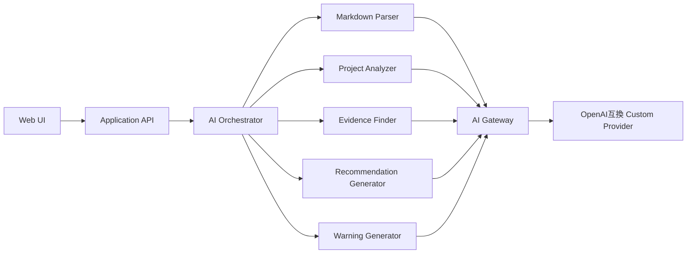

# AIアーキテクチャ

## 基本方針

AIは単一機能ではなく、専門コンポーネントへ分割する。初期版は閉じた社内ネットワークで動作するプロトタイプとする。



## AI Gateway設定

```dotenv
AI_PROVIDER=custom
AI_BASE_URL=http://ai-gateway.internal:8000/v1
AI_API_KEY=replace-me
AI_MODEL=recommendation-default
AI_TIMEOUT_SECONDS=120
AI_MAX_RETRIES=2
```

- `.env` はリポジトリへコミットしない
- `.env.example` に実値を含めない
- プロトタイプではSecret ManagerやVaultを必須としない
- 本番化または外部公開時に秘密管理方式を再検討する

## 専門コンポーネント

- Markdown Parser
- Project Analyzer
- Evidence Finder
- Recommendation Generator
- Warning Generator

## AI利用制約

- 根拠のない事実を生成しない
- 推薦可否を判定しない
- 人材をスコアリングしない
- 上司の意図を上書きしない
- AI出力は構造化し、スキーマ検証する
