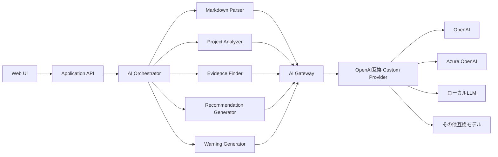

# AIアーキテクチャ

## 1. 基本方針

AIは単一の巨大機能ではなく、責務ごとに分離した専門コンポーネントとして設計する。

## 2. 全体構成



## 3. AI Gateway

AI GatewayはOpenAI互換APIを提供する。  
アプリケーションはOpenAI SDK互換のクライアント、または同等のHTTPクライアントからCustom Providerとして接続する。

### 接続設定例

```yaml
provider: custom
base_url: https://ai-gateway.example.com/v1
api_key_secret_ref: ai-gateway-api-key
model: recommendation-default
timeout_seconds: 120
max_retries: 2
```

認証情報はDBへ平文保存しない。  
Secret Manager、Vault、Kubernetes Secretなどを利用する。

## 4. AI Orchestrator

AI Orchestratorは以下を担当する。

- 用途別コンポーネントの呼び出し
- 入力データの組み立て
- トークン上限を考慮したデータ選択
- AIジョブの状態更新
- 構造化出力の検証
- リトライ
- エラー変換
- プロンプトバージョンの記録

## 5. 専門コンポーネント

### Markdown Parser

入力:

- Markdown本文
- テンプレートバージョン
- 画面で選択されたメンバーID
- 画面で選択された案件ID

出力:

- 報告種別
- 対象期間
- 実施内容
- 成果
- 課題
- 工夫
- 使用技術
- 本人コメント
- 上司コメント
- 警告一覧

### Project Analyzer

入力:

- 案件概要
- 複数の案件報告
- 関連評価
- 上司コメント

出力:

- 事実の要約
- スキル候補
- 強み候補
- 根拠マッピング
- 情報不足

自動実行せず、上司が任意実行する。

### Evidence Finder

入力:

- 推薦目的
- 推薦先要件
- 強調点
- メンバーの案件・評価・スキル

出力:

- 推薦文に利用可能な根拠
- 根拠の出典ID
- 利用対象段落候補
- 根拠不足項目

### Recommendation Generator

入力:

- 推薦目的
- 出力条件
- Evidence Finderの結果
- 上司が入力した推薦意図

出力:

- 推薦文ドラフト
- 段落単位の根拠参照
- 警告

### Warning Generator

警告例:

- 必須見出しがない
- 日付形式を解釈できない
- 推薦要件に対応する根拠がない
- AI生成文に根拠が紐付かない
- 参照データが古い可能性がある

警告は処理を原則停止しない。

## 6. 構造化出力

AI出力はJSON Schema等で検証する。

```json
{
  "draft": [
    {
      "paragraph_no": 1,
      "text": "推薦文の段落",
      "evidence": [
        {
          "source_type": "project_report",
          "source_id": "uuid",
          "quote_or_summary": "根拠の要約"
        }
      ]
    }
  ],
  "warnings": []
}
```

## 7. 禁止事項

- 根拠のない事実追加
- 推薦可否判定
- 人材スコア
- ランキング
- 性格や能力の断定
- 属性に基づく差別的推論
- 上司の感情や意図の上書き

## 8. プロンプト管理

- プロンプトは用途別に管理する
- バージョン番号を付与する
- AI分析・推薦文生成の実行履歴へ保存する
- 本番変更はシステム運用者のみ可能とする
- 変更前後を監査ログへ残す

## 9. 障害時

- タイムアウト時はAIジョブをfailedへ更新する
- 部分成功したMarkdown解析は保存可能とする
- 推薦文生成失敗時は既存バージョンを破棄しない
- 再実行は新しいAIジョブとして記録する
