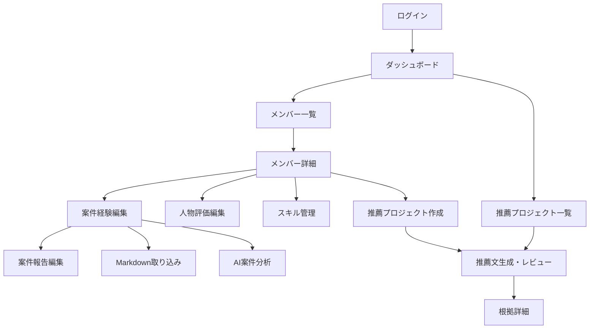

# 画面設計

## 1. 画面一覧

| ID     | 画面名               | 主利用者     |
| ------ | -------------------- | ------------ |
| SCR-01 | ログイン             | 全利用者     |
| SCR-02 | ダッシュボード       | 部長・運用者 |
| SCR-03 | メンバー一覧         | 部長         |
| SCR-04 | メンバー詳細         | 部長         |
| SCR-05 | 案件経験編集         | 部長         |
| SCR-06 | 案件報告編集         | 部長         |
| SCR-07 | Markdown取り込み     | 部長         |
| SCR-08 | AI案件分析           | 部長         |
| SCR-09 | 人物評価編集         | 部長         |
| SCR-10 | スキル管理           | 部長         |
| SCR-11 | 推薦プロジェクト一覧 | 部長         |
| SCR-12 | 推薦プロジェクト作成 | 部長         |
| SCR-13 | 推薦文生成・レビュー | 部長         |
| SCR-14 | 根拠詳細             | 部長         |
| SCR-15 | 監査ログ             | 部長・運用者 |
| SCR-16 | ユーザー・部署管理   | 運用者       |
| SCR-17 | AI Gateway設定       | 運用者       |
| SCR-18 | データ保持設定       | 運用者       |
| SCR-19 | 削除済みデータ管理   | 運用者       |

## 2. 画面遷移

## 3. Markdown取り込み画面

### 入力

- 対象メンバー
- 対象案件
- Markdownファイル
- 元ファイルを保存するか
  - システム設定で固定する場合は表示しない

### 実行結果

- 作成された案件報告
- 抽出されたスキル候補
- 警告一覧
- 自動反映された項目
- 修正リンク

### 警告表示

警告は以下の状態を持つ。

- 未対応
- 修正済み
- 無視

## 4. 推薦文生成・レビュー画面

### 左ペイン

- 推薦目的
- 推薦先
- 要件
- 強調点
- 参照対象
- 生成条件

### 中央ペイン

- 推薦文エディタ
- バージョン切り替え
- AI再生成
- 保存
- 最終確定

### 右ペイン

- 選択段落の根拠
- 根拠元の案件・報告・評価
- AI警告
- AIモデル・生成日時
- 上司編集済み表示

### UX方針

- 警告は明示するが、確定操作を原則禁止しない
- AI生成部分と上司編集部分を追跡できる
- スコアやランキングを表示しない
